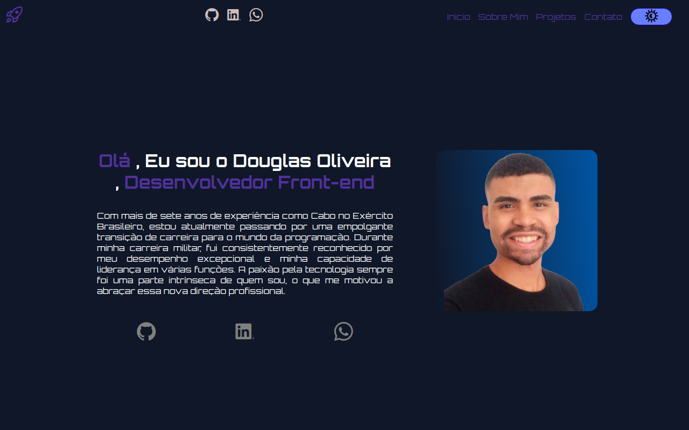

# Portfólio de Desenvolvedor Front-End - Douglas Oliveira

Bem-vindo ao meu portfólio de desenvolvedor front-end, construído com Angular. Aqui, você encontrará uma visão geral dos meus projetos e das habilidades que desenvolvi ao longo da minha jornada como desenvolvedor web.

## Principais Recursos

- 🍔 **Menu Hamburguer Responsivo:** O menu deste portfólio é totalmente responsivo e apresenta um elegante ícone de hamburguer para uma experiência de usuário amigável em dispositivos móveis.

- 🌙 **Botão de Dark Mode:** O portfólio inclui um botão de "Dark Mode" que permite aos visitantes alternar entre os modos de luz e escuro para uma experiência de navegação personalizada.

- 🚀 **Projetos Destacados:** Você encontrará uma variedade de projetos que demonstrem minhas habilidades como desenvolvedor front-end. Desde sites estáticos até aplicações web interativas, cada projeto exibe meu comprometimento com a qualidade e a estética.

## Como Entrar em Contato

- 📧 **Email:** Se você gostaria de entrar em contato comigo, por favor, envie um e-mail para [douglas.olliveira1997@gmail.com](mailto:douglas.olliveira1997@gmail.com).

- 🔗 **LinkedIn:** Você pode conferir meu perfil no LinkedIn [LINKEDIN](https://www.linkedin.com/in/douglas-oliveira-625064271/).

## Como Contribuir

- 👍 Contribuições são bem-vindas! Sinta-se à vontade para abrir problemas ou enviar solicitações de pull se quiser colaborar com algum dos projetos.

## Licença

Este portfólio está licenciado sob a Licença MIT.

---

Obrigado por visitar meu portfólio! Estou empolgado para compartilhar meu trabalho e discutir oportunidades de colaboração.

